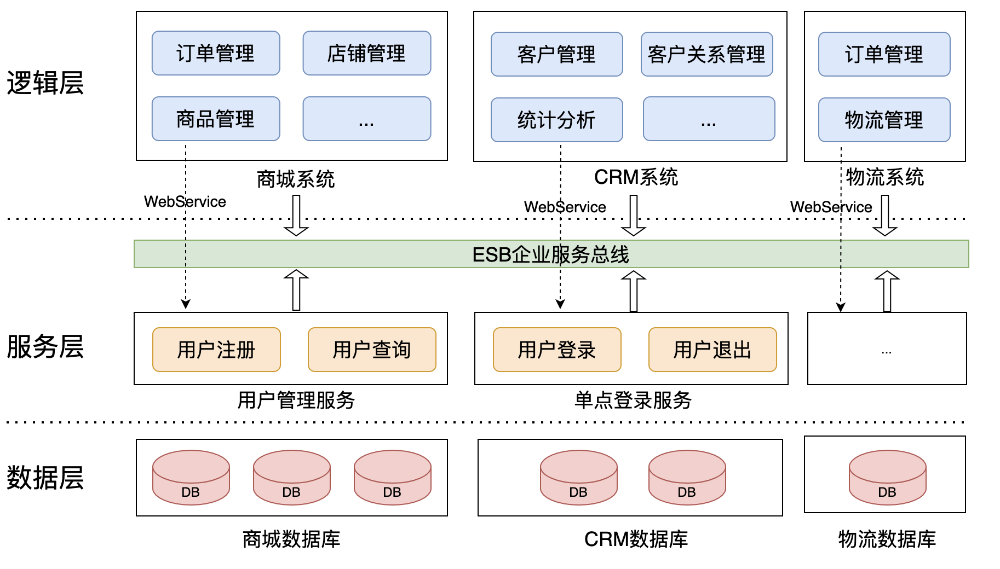

# 软件服务架构演变

首先一起回顾下软件服务架构的演变过程，了解下不同的发展阶段所面临的一些具体的问题场景，以及前辈们所提出的用以化解这些问题的软件服务架构。回头看软件服务架构的演变过程，也不禁感叹正是互联网行业的迅速发展才引入了这么多的挑战，庆幸的是不同阶段总会诞生一批优秀的“思想家”来点亮夜路。

## 简介

服务架构的演变，并不是偶然，它是由诸多因素共同驱动的，比如要解决的问题规模、团队采用的技术栈、追求更快速的交付，希望保证可维护性、可扩展性、可伸缩性，等等。这些因素决定了我们必须要在软件架构上进一步优化，才能应对面临的挑战。

大致上，软件服务架构经历了单体架构、SOA架构、微服务架构这几种形式。

## 单体架构

单体架构，指的是在一个应用程序中打包业务场景涉及到的所有功能。如将一个电商系统完整打包在一个WAR包，然后在Web容器中运行。

当软件规模不是很大的时候，单体架构是比较合适的，开发、测试、部署、监控等相对来说也是比较方便的。但是随着软件规模的扩大，问题会变得越来越复杂。

* 新人很难快速掌握，很难快速支持新特性开发、调整、优化；
* 多个团队负责、同时开发，代码冲突、测试冲突问题频发，影响开发效率；
* 采取集群部署来提升并发处理能力，单体应用难以细粒度伸缩，如A、B模块扩容实例数可能不同；
* 云计算如日中天，服务上云成为趋势，单体应用每次变更、升级都要完整部署整个应用，效率低；
* 单体应用一般采用相同的技术栈，不能灵活选择更合适的技术来解决个别部分的问题；
* 其他问题；

单体架构有它的简单的优势，这个我们是很容易体会到的。但是，还是要结合业务场景、未来规划来科学评估系统复杂度、未来支撑业务量级以对软件架构做出更科学合理的规划。

## 分布式\(单体\)架构

为了解决大型软件系统开发中的问题，在单体架构的基础上进行进一步的优化。按照业务功能对原有软件进行垂直拆分，拆分得到多个边界清晰的业务子系统，每个业务子系统采用单体架构，每个子系统都可以分布式部署。

分布式\(单体\)架构一定程度上解决了单体架构的不足，但是它仍然存在一些问题。

和单体架构相比，它已经能够按功能进行更细粒度的划分，并且各个子系统能够更细粒度地伸缩。不同的子系统可以交由不同的团队来进行维护，甚至可以选择不同的技术栈（如有必要），开发、测试、部署也更顺畅。

但是其这里的按子系统功能垂直拆分粒度过于粗放，各个子系统之间存在数据冗余，如需要在商城系统和物流系统之间同步订单数据等等。各个子系统由于仍是单体架构，子系统内部各部分按需伸缩能力不足。

## SOA架构

SOA架构（面向服务的架构），是在分布式架构基础上的进一步优化。将一些公共的基础服务提炼出来，以接口的形式暴露出来给其他服务调用，如将用户管理、单点登录等功能提取出来作为基础服务供各个子系统调用。

各个子系统通过企业服务总线ESB与其他子系统进行交互，具体的可以是通过Web Service、RPC来实现。

SOA架构进一步解决了分布式架构存在的问题，现在我们可以将一些公共的功能提炼为基础服务，提高复用性，同时这些基础服务、各个子系统也可以进行更细粒度的伸缩，同时，采用ESB也减少了整个系统中服务与服务之间的耦合。

SOA架构也并非就是完美的，比如逻辑层和服务层之间的边界如果拿捏不准，可能导致抽取的基础服务的粒度过大，导致逻辑层过多依赖服务层，耦合严重。另外，引入ESB进一步简化了系统集成的问题，降低了不同服务之间的耦合，但是系统大了之后，各个服务接口的协议也变多，ESB需理解这些协议才能执行后续的订阅分发、转发等操作，协议的维护会变得困难。

## 微服务架构

微服务架构中对公共功能进行提炼，提炼成一些更细粒度的服务，并以接口的形式对外提供服务。这里的更细粒度的服务，即微服务。

从微服务的概念上，读者朋友可能会觉得它和SOA有点接近。其实微服务架构和SOA还是有区别的。SOA侧重于系统的集成，过了这么多年，SOA本身也在演进，比如服务公开的手段也从以前的SOAP等Web Service技术演进为API等。

微服务架构的核心思想就是按照服务功能进行最小粒度拆分，以尽可能做到服务功能的高内聚、低耦合，也方便后续实现更高程度的复用，也方便进行更细力度地伸缩。当然了不同的微服务可以由不同的团队负责，开发人员也可以更自由地选择合适的技术栈进行开发（如果有必要）。各个微服务都可以快速迭代、测试、上线，也有助于提高研发效率。

微服务并不是说按照功能把服务粒度拆的更细之后就结束了，我们还面临着一系列运维上的挑战。相比单体应用，微服务架构的服务数量多了很多，如何合理有效地管理、监控这么多微服务，是一项巨大的挑战，包括对于分布式事务的处理。幸运的是，业界已经积累了很多这方面的研究，如名字服务、分布式日志、分布式跟踪等等，我们也将在后续"_框架编码实现"_章节中进一步展开。

## 参考文献

1. Micro Services - Java the Unix Way, [http://2012.33degree.org/pdf/JamesLewisMicroServices.pdf](http://2012.33degree.org/pdf/JamesLewisMicroServices.pdf)
2. Micro-Service Architecture, [https://archive.oredev.org/oredev2012/2012/sessions/micro-service-architecture.html](https://archive.oredev.org/oredev2012/2012/sessions/micro-service-architecture.html)
3. Microservices: A Definition of this New Architectural Term, [https://martinfowler.com/articles/microservices.html](https://martinfowler.com/articles/microservices.html)
4. 软件架构的演变, [https://zhuanlan.zhihu.com/p/98392801](https://zhuanlan.zhihu.com/p/98392801)
5. Microservices, SOA, and API: Friends or Enemies, [https://developer.ibm.com/tutorials/1601\_clark-trs/](https://developer.ibm.com/tutorials/1601_clark-trs/)

