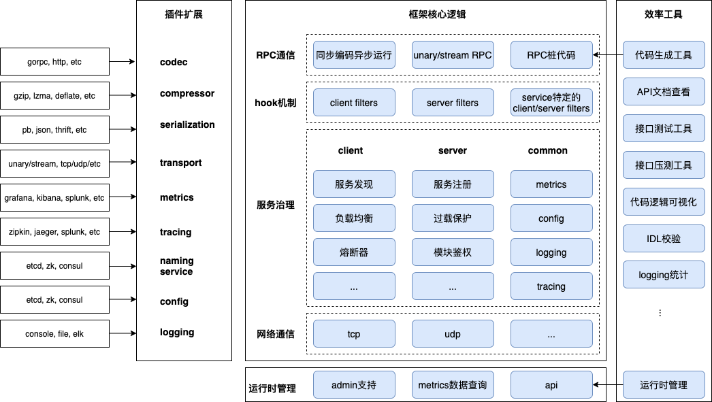
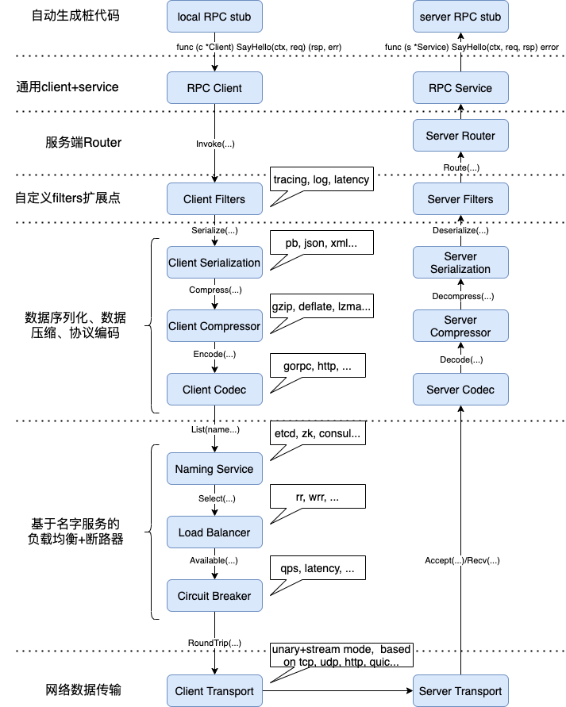

# 整体设计

## 整体架构

根据前面确定的设计目标，来设计开发我们的微服务框架gorpc，gorpc的整体（功能）架构如下图所示。

结合gorpc整体架构图，简单介绍下各部分关注的一些目标：

* 网络通信：网络通信是基本能力，对于主流的传输层协议tcp、udp要予以支持；
* RPC通信：在网络通信基础上构建RPC简化服务间调用，借助代码生成工具生成网络通信代码；
* hook机制：围绕着RPC可以增加hook机制，在RPC发起前后增加扩展点来增强RPC相关的能力，如流水日志、模调上报、耗时分布统计、链路跟踪、流量录制等；
* 服务治理：微服务工程化是一个系统性工程，框架要考虑服务治理相关能力，如服务注册、服务发现、监控、配置中心、远程日志、分布式跟踪、模块鉴权等；
* 扩展性：不同业务团队会根据自身需要灵活选择技术运营体系，因此框架要支持可扩展，如协议编解码、数据压缩、序列化方式、监控系统、分布式跟踪、远程日志等的扩展；
* 效率工具：理解框架设计、服务运行情况需要时间、经验，提供一个效率工具来将屏蔽一些复杂性，如代码生成充当框架和业务代码的粘合剂、输出服务健康信息、接口压测、接口测试、接口模糊测试、日志统计等；

## 概要设计

在建立了对框架整体架构的认识之后，我们可以进行概要设计了。概要设计的过程，我们将对各个核心模块进行必要的抽象设计，确定其大致的接口、与其它模块的依赖关系、理顺其能力边界。

这个过程也是需要反复打磨的，这样才能尽量将模块间的功能边界理清楚，接口设计也能尽量稳定下来。

结合上述概要设计UML图，我们来理解下各个模块的作用和设计，图中的包就是划分的模块。

* helloworld：代码生成工具根据协议描述文件（如protobuf或者flatbuffer）生成service、client的接口定义，主要包含RPC的方法定义。对client实现而言，就是要屏蔽掉RPC内部的网络通信细节；对服务端而言，就是要生成各个RPC方法请求处理的空方法；
* codec：该模块负责完成协议编解码、压缩&解压缩、序列化&反序列化、rpc上下文的构建的工作；
* server：该模块是服务端处理逻辑，包括收包、解包、拦截器处理、路由转发、任务池、协程池、过载保护、请求处理、回包等等；
* client：该模块是客户端处理逻辑，包括发包、协议组包、拦截器处理、服务发现、负载均衡、断路器、连接池管理、网络通信等等；
* registry：该模块主要完成服务注册、服务发现功能，以便对后端实例故障进行容错；
* selector：该模块是一个建立在名字服务基础上的负载均衡实现，篇幅原因没有在图中绘制完全；
* 其他

这里其实只是一个概要设计，每一个模块的设计详细还需要进一步细化，还有些基础模块我们甚至没有在这里提及，如config、logging等等。详细设计将在后续小节“模块设计”部分展开。

## 通信流程

在了解了上述gorpc整体架构、概要设计后，接下来再来了解下一个完整的RPC通信流程是怎样的，这里会涉及到各个核心模块之间的关系、交互顺序、扩展点。

一个完整的RPC通信流程，包括客户端、服务端两部分。

### 客户端通信流程

1. 初始化rpc client；
2. 通过rpc client发起rpc调用；
3. 执行client side拦截器链；
4. 对请求体进行序列化、压缩、协议编码；
5. 执行服务发现获取服务实例ip列表，执行负载均衡获取下一个待请求实例ip，检查断路器；
6. 网络通信传输请求，等待服务端响应；
7. 收到服务端响应后，执行与前述顺序相反的系列操作，将反序列化后的响应结果返回给调用方；

至此，rpc的客户端部分执行完成。

### 服务端通信流程：

1. 服务端启动监听；
2. 服务端收到入连接请求，建立连接；
3. 服务端从连接上读取请求体；
4. 服务端执行协议解码、解压缩、反系列化的过程；
5. 服务端执行server side拦截器链；
6. 服务端从请求体包头中获取rpc方法名，将请求路由到对应的处理方法；
7. 执行处理方法完成请求处理；
8. 服务端继续执行与上述顺序相反的系列操作，完成响应的编码；
9. 服务端发送响应数据给client；

至此，rpc的服务端部分执行完成。

## 小结

本小节介绍了gorpc微服务框架的整体功能架构、概要设计、RPC通信流程，从全局上有了一个基本的认识，这是一个不错的开始，接下来将深入各模块完成详细设计。过程中我们将讨论一些可能的应用场景，以及如何通过架构调整、设计模式来实现可扩展性的同时消除复杂性，在编码实现环节我们再介绍如何使用go来实现。

## 参考文献

1. [Regine Meunier](https://www.google.com/search?newwindow=1\&sxsrf=ALeKk00tC6aVFqglc\_\_GX3fxQx\_9ukk-2g:1600609025720\&q=Regine+Meunier\&stick=H4sIAAAAAAAAAOPgE-LRT9c3NErKzU5OyTZS4gXxDJPK08oKy83jtWSyk630k_Lzs_XLizJLSlLz4svzi7KtEktLMvKLFrHyBaWmZ-alKvimluZlphbtYGUEAMQxpKBRAAAA\&sa=X\&ved=2ahUKEwipv5uj7ffrAhUNqJ4KHTtZBBoQmxMoATCCAXoECA8QAw), [Frank Buschmann](https://www.google.com/search?newwindow=1\&sxsrf=ALeKk00tC6aVFqglc\_\_GX3fxQx\_9ukk-2g:1600609025720\&q=Frank+Buschmann\&stick=H4sIAAAAAAAAAOPgE-LRT9c3NErKzU5OyTZSgvAKLJMtCgqqtGSyk630k_Lzs_XLizJLSlLz4svzi7KtEktLMvKLFrHyuxUl5mUrOJUWJ2fkJubl7WBlBAC-azEKUQAAAA\&sa=X\&ved=2ahUKEwipv5uj7ffrAhUNqJ4KHTtZBBoQmxMoAjCCAXoECA8QBA), [Hans Rohnert](https://www.google.com/search?newwindow=1\&sxsrf=ALeKk00tC6aVFqglc\_\_GX3fxQx\_9ukk-2g:1600609025720\&q=Hans+Rohnert\&stick=H4sIAAAAAAAAAOPgE-LRT9c3NErKzU5OyTZS4gXxDNMMjczKTIvitWSyk630k_Lzs_XLizJLSlLz4svzi7KtEktLMvKLFrHyeCTmFSsE5WfkpRaV7GBlBADx7\_iFTwAAAA\&sa=X\&ved=2ahUKEwipv5uj7ffrAhUNqJ4KHTtZBBoQmxMoAzCCAXoECA8QBQ), [Peter Sommerlad](https://www.google.com/search?newwindow=1\&sxsrf=ALeKk00tC6aVFqglc\_\_GX3fxQx\_9ukk-2g:1600609025720\&q=Peter+Sommerlad\&stick=H4sIAAAAAAAAAOPgE-LRT9c3NErKzU5OyTZSAvMykvPKknPNcrVkspOt9JPy87P1y4syS0pS8-LL84uyrRJLSzLyixax8geklqQWKQTn5-amFuUkpuxgZQQAjf0aZFEAAAA\&sa=X\&ved=2ahUKEwipv5uj7ffrAhUNqJ4KHTtZBBoQmxMoBDCCAXoECA8QBg), [Michael Stal](https://www.google.com/search?newwindow=1\&sxsrf=ALeKk00tC6aVFqglc\_\_GX3fxQx\_9ukk-2g:1600609025720\&q=Michael+Stal\&stick=H4sIAAAAAAAAAOPgE-LRT9c3NErKzU5OyTZS4tLP1TdIT8syNy3RkslOttJPys_P1i8vyiwpSc2LL88vyrZKLC3JyC9axMrjm5mckZiaoxBckpizg5URADspXHNMAAAA\&sa=X\&ved=2ahUKEwipv5uj7ffrAhUNqJ4KHTtZBBoQmxMoBTCCAXoECA8QBw), Pattern-Oriented Software Architecture : A System of Patterns, 1995

